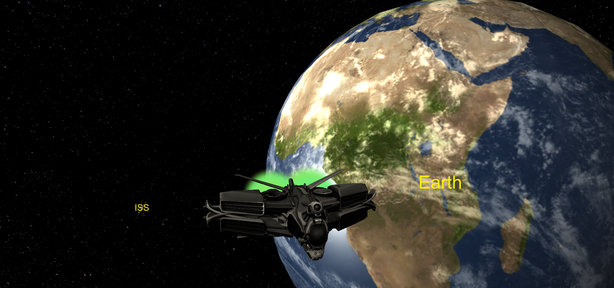
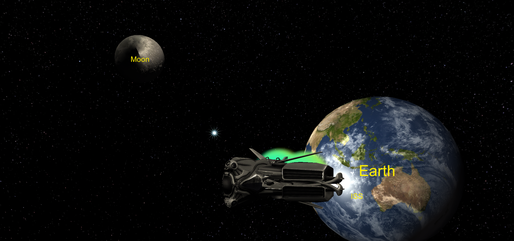
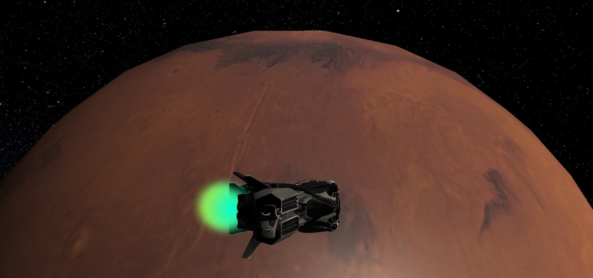
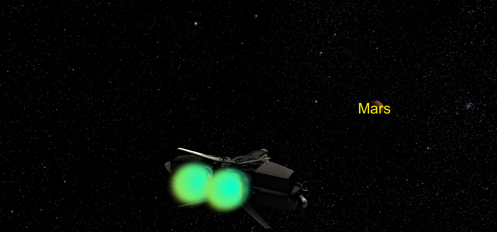

# The Last Man

The Last Man is a Sci-Fi game about exploring space.

## About the game

The Last Man is a game about exploring space developed mainly during [NASA Space Apps 2020](https://2020.spaceappschallenge.org/challenges/create/breakthrough/teams/game-of-throws/project) hackathon, it was developed in 48 hours as a functional prototype. The main goal of the game was to make players learn more about propulsion technologies and spread awareness about this science.

Our team got awarded the **Create category winner** in [Nasa Space Apps Cairo](https://www.facebook.com/spaceappscairo/photos/ms.c.eJw1zNkNADEIA9GOVsTGHP03Fi0Kv0~_aIdzRp9GGTq~_PAy4HAwVbyDNgfBBVfwLhQWYqWsVNUhiQFjgPOS~_S8RgB.bps.a.3244291512363123/3244297525695855).

## Story line

The **Last Man** is the last human existing; he was on the ISS when all humans died due to the 2100 radioactive hazard caused by climate change, humans had a protocol in mind when such event happens, the *Last Man* should carry a container of frozen human embryos and search for a habitable planet to carry them into. The *Last Man* will use different spacecrafts and engines to complete his mission, these spacecrafts will be collected from different places and will be made in different periods of human propulsion innovation.

## Game mechanics

The *Last Man* will be travelling with his spacecraft to search for materials, technologies and AstroCoins to build and upgrade his arsenal of space technologies and tools. The game is a 3D 3rd person adventurer, the player should complete his objectives while maintaining life support resources. While keeping the difficulty curve at a level where the player can learn about the technologies he use as well as having fun and an intensive to continue the journey.

## Screenshots

## Download

This game is still a prototype, you can download it from the [releases](https://github.com/KareemMAX/LastMan/releases).

## Credits

Some of the assets was obtained from [Free3D.com](https://free3D.com/), [SketchFab.com](https://sketchFab.com/), [NASA 3D Resources](https://nasa3d.arc.nasa.gov/) and [GrabCAD.com](https://grabCAD.com/).

| [ <b>Kareem Morsy</b> <b>@KareemMAX</b>](https://github.com/KareemMAX) <b>Game Developer</b>  | [ <b>Mohamed Dein</b> <b>@MohamedDein</b>](https://github.com/MohamedDein) <b>3D Artist, Researcher</b>  | [ <b>Abdelaziz Ashraf</b> <b>@Abdelaziz237</b>](https://github.com/Abdelaziz237) <b>Developer</b>  | [ <b>Omar Ahmed</b> ](https://www.facebook.com/3ooomar.ahmed) <b>3D Artist</b>  | [ <b>Youssif Ayman</b> ](https://www.facebook.com/youssif.ayman.758) <b>Researcher</b>  
| :-------------------------------------------------------: | :---------------------------------------------------------: | :---------------------------------------------------------: | :---------------------------------------------------------: | :---------------------------------------------------------: |
